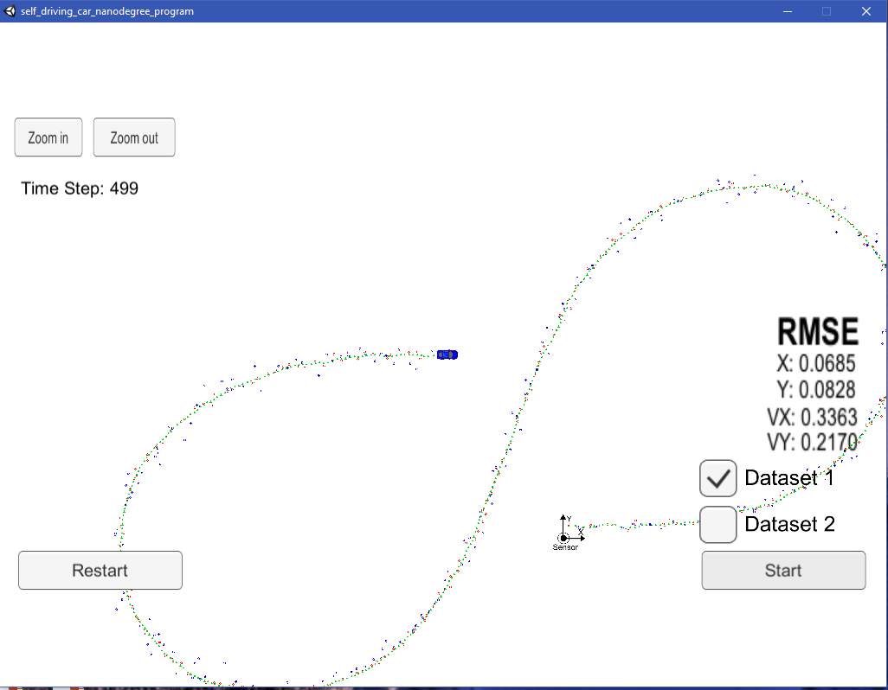

Unscented Kalman Filters
=======================

### Introduction

Because this was my second serious C++ project, it was much less daunting.
But, since I'm far from an expert, I needed the MyCodeBits project to help me
tie lesson 7 together.

### Compiling

#### Code must compile without errors using cmake and make.

My code compiles without errors; however it generates numerous warnings. To correct this issue, I had to modify the following line of CMakeLists.txt:

| From:                                | To:                                     |
|--------------------------------------|-----------------------------------------|
| set(CMAKE_CXX_FLAGS "\${CXX_FLAGS}") | set(CMAKE_CXX_FLAGS "\${CXX_FLAGS} -w") |

After the above modification, the [cmake] and [make] output looks good:

### Accuracy

**px, py, vx, vy output coordinates must have an RMSE \<= [.09, .10, .40, .30]
when using the file: "obj_pose-laser-radar-synthetic-input.txt" which is the
same data file the simulator uses for Dataset 1.**

Using Dataset 1, the RMSE is well under the target values for X, Y, VX and VY:

Dataset

Using Dataset 2, the RMSE is also below target on all values except VY:

Dataset

### Follows the Correct Algorithm

**Your Sensor Fusion algorithm follows the general processing flow as taught in
the preceding lessons.**

Lesson 7 formed the baseline and foundation for my Sensor Fusion
Algorithm. My coding follows the UKF Roadmap:

**Your Kalman Filter algorithm handles the first measurements appropriately.**

My algorithm uses the first measurements to initialize the state vector. I
initialized the state vector at the beginning of the UKD::ProcessMeasurement function.

**Your Kalman Filter algorithm first predicts then updates.**

Upon receiving a measurement after the first, my algorithm predicts object
position to the current timestamp and then updates the prediction using the new
measurement.

#### Your Kalman Filter can handle radar and lidar measurements.

My algorithm sets up the appropriate matrices given the type of measurement and
calls the correct measurement function for a given sensor type.

### Code Efficiency

**Your algorithm should avoid unnecessary calculations.**

I avoided the following:

-   Running the exact same calculation repeatedly when I could run it once,
    store the value and then reuse the value later,

-   Loops that run too many times,

-   Creating unnecessarily complex data structures when simpler structures work
    equivalently,

-   Unnecessary control flow checks.
