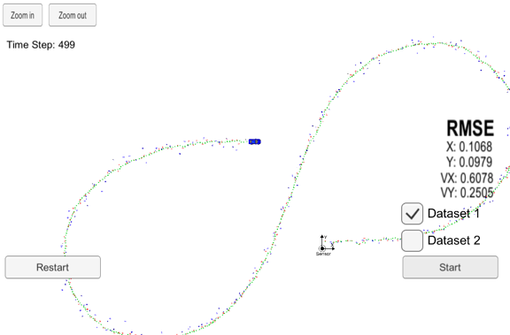

Project 2, Term 2: Unscented Kalman Filters
=======================

Final Result
------------

Compiling
---------

#### Code must compile without errors using cmake and make.

The code compiles without errors:

Accuracy
--------

**px, py, vx, vy output coordinates must have an RMSE \<= [.09, .10, .40, .30]
when using the file: "obj_pose-laser-radar-synthetic-input.txt" which is the
same data file the simulator uses for Dataset 1.**

-------------------
##### Dataset 1 (Radar and Lidar)
RMSE is well under the target values for X, Y, VX and VY:

-------------------
##### Dataset 2 (Radar and Lidar)
RMSE is below the target values for X, Y and VX:

-------------------
##### Dataset 1 (Radar only)
RMSE is above target values for X, Y and VY:

-------------------
##### Dataset 1 (Lidar only)
RMSE is above target values for X and VX:

-------------------
##### Dataset 1 (Radar and Lidar - Extended Kalman)
Extended Kalman RMSE values are worse than Unscented Kalman values for X, Y, VX and VY:

---------------

Follows the Correct Algorithm
-----------------------------

**Your Sensor Fusion algorithm follows the general processing flow as taught in
the preceding lessons.**

The Sensor Fusion algorithm follows the UKF Roadmap as described in the Unscented Kalman Filters lesson of Udacity's Self-Driving Car Engineer Nanodegree Program, Part 2 -  Sensor Fusion, Localization and Control:

**Your Kalman Filter algorithm handles the first measurements appropriately.**

The algorithm uses the first measurements to initialize the state vector. The state vector is initialized at the beginning of the UKD::ProcessMeasurement function.

**Your Kalman Filter algorithm first predicts then updates.**

Upon receiving a measurement after the first, the algorithm predicts object
position to the current timestamp and then updates the prediction using the new
measurement.

**Your Kalman Filter can handle radar and lidar measurements.**

The algorithm calls the same function for both radar and lidar measurements; however, it sets up the appropriate matrices given the type of measurement.

Code Efficiency
---------------

**Your algorithm should avoid unnecessary calculations.**

I avoided the following:

-   Running the exact same calculation repeatedly when I could run it once,
    store the value and then reuse the value later,

-   Loops that run too many times,

-   Creating unnecessarily complex data structures when simpler structures work
    equivalently,

-   Unnecessary control flow checks.
